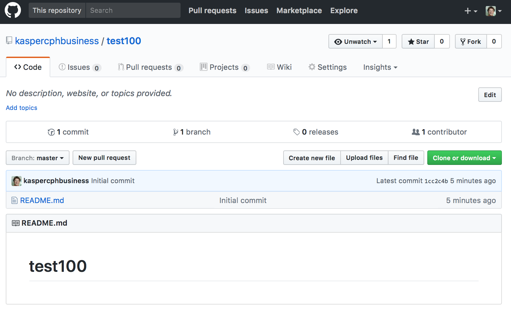
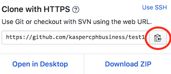

# Git
**Der er en opgave nederst på siden som I skal lave parvis.**

Git er et system der bruges til at holde styr på ens kildetekst over tid. Det er et system der kan rigtigt meget på rigtigt mange forskellige måder. 

## Læringsmål
Ideen er at du efter at have arbejdet med denne note skal:

- kunne arbejde sammen i en gruppe om kildetekst
- kunne bruge git fra git bash til at lave nye versioner og hente andres opdateringer
- lave dit egen konto på github og oprette projekter og dele dem

## Erhvervsrelevans
Der findes ikke nogen steder, hvor man udvikler software, uden at have et versionshåndteringssystem. Git er idag blandt de mest udbredte.

## Hvorfor et version styringssystem?
Der er en række situationer som et versionssystem skal kunne håndtere. Nogle eksempler er:

- Tillade at to udviklere arbejder på hver sin del, og så hjælpe med at *flette* de to dele sammen igen.
- At kunne lægge en tidligere version til side - for eksempel lave en version, som lige præcis er det system, der blev leveret til kunde A, så vi kan se hvad der er rettet af fejl siden da.
- At kunne prøve en ny idé af, og smide den ud, hvis det ikke duer.
- Kildekode er din virksomheds levebrød. Versionssystemer fungerer også som back-up.

## Git begreber

### Workspace
Workspace (arbejdsområde) er de filer der er i din normale filstruktur. Tænk på et IntelliJ projekt som et eksempel.

### Snapshot
Et snapshot er en kopi af dit workspace som man kan vende tilbage til (vende tilbage til betyder at det er nemt at kopiere et snapshot tilbage i workspace)

### Repository 
Repository (lager) er hvor git lægger snapshots af workspace til side så man kan vende tilbage til det hvis der bliver behov for det. I praksis arbejder man med to repositories i git:

* Et *lokalt repository* som er på din egen maskine. Det tillader at du kan lave nye snapshots selv. Det lokale repository er i et katalog der hedder ".git" i roden af dit netbeans projekt.
* Et *delt repository* som ligger på en server som alle i teamet kan arbejde dele.

#### Staging area (også kaldet "index")
Dette er et specielt snapshot som git holder styr på, men som endnu ikke er lagt i repository (staging area kan vel her oversættes til "byggepladsen"). Avancerede brugere kan lave alle mulige sjove ting med det. Vi kommer blot til at bruge det som mellemled mellem workspace og lokalt repository.

### Git kommandoer
Der er nogle få kommandoer vi kommer til at bruge fra git-bash:

`git status` 

* denne kommando fortæller dig:

  * hvilke filer der er nye i workspace (i forhold til staginging area)
  * hvilke filer der er ændret i workspace (i forhold til staginging area)
  * hvilke filer der er nye/ændrede i staging area sammeholdt med seneste snapshot i lokal repository
  * forholdet mellem dit lokale repository og det delte repository

`git add .` 

* tilføjer alle ændringer i workspace til staging area.

`git commit -m"beskrivelse"` 

* lægger snapshot fra staging area over i lokal repository. Beskrivelsen skal kort sige hvad du ændrede i denne version.

`git log`

* Denne giver en liste over de snapshots der er i repository. 

`git clone URL`

* bruges til at lave en lokal kopi af et delt repository. Dette er langt den nemmeste måde at starte et lokalt repository.

`git push`

* opdaterer det delte repository til også at inkludere de snapshots du har i dit lokale repository

`git pull`

* opdaterer dit lokale repository til også at have de snapshots der er i det delte repository

Dette er en oversigt over de mest brugte kommandoer i git. Og vi vil næppe bruge ret mange af dem.


## Opsætning

Der er flere måder at gøre det på, men det *nemmeste* er at starte på github. 

### Lav et nyt projekt på github
1. Du skal oprette en konto på github
2. Dernæst skal du oprette et nyt repository (det er det lille "+" i øverste højre hjørne)
3. Du vil blive spurgt om navn på repository - tænk på dette navn som det samme navn du ville bruge til et netbeans projekt
4. LAV README FILEN!!!!

Du skulle nu gerne se noget der minder om dette:



### Gitignore
Dette er en lille knast vi skal over. Når vi siger `git add -A` så vil git lægge alle nye eller ændrede filer i workspace over i staging area. Men der er mange ting der *ikke* skal med. F.eks.

* Filer der er specifikke til Mac (ikoner mv)
* Filer der er specifikke til Windows (ikoner mv)
* Filer der indeholder personlige indstillinger for netbeans
* Filer der er oversatte java programmer

For at gøre dette til at holde ud i praksis, så kan man lave en speciel fil der hedder `.gitignore` som placeres øverst i projektet. 

1. Download denne [.gitignore](sample_gitignore.txt) fil. (som er en jeg har lavet)
2. På det nye projekt i github, vælg den knap der hedder "Create new file" (lidt til venstre for den store grønne knap).
3. Dette åbner et vindue hvor jeg kunne paste indholdet fra den downloadede `.gitignore` fil ind, og du kan navngive filen ".gitignore". - Github opdager du er ved at lave en gitignore fil, men den hjælp den giver er ikke god nok!.
4. skriv en kort besked i "commit changes" (f.eks. *tilføjede .gitignore fil*)

### Clone repository
Hvis du trykker på den store grønne knap, kommer der en mulighed frem hvor du kan vælge "copy url til clipboard":



#### Så skal du over i git-bash....
Jeg vil anbefale at du laver et katalog i dit filsystem du bruger til git-projekter. Flyt dig derhen vha. `cd` kommandoen.

I kommando prompten skal du så skrive `git clone URL`, hvor URL er det du kopiere de fra github.

git clone kommandoen skulle så gerne skrive noget i stil med:

```
$ git clone https://github.com/kaspercphbusiness/test100.git
Cloning into 'test100'...
remote: Counting objects: 7, done.
remote: Compressing objects: 100% (5/5), done.
remote: Total 7 (delta 1), reused 0 (delta 0), pack-reused 0
Unpacking objects: 100% (7/7), done.
$
```


**Tillykke du har nu dit første lokale git repository!**


#### kopier filer ind i workspace
Du har sikkert allerede et netbeans projekt. Du kan nu kopiere filerne ind i det nyt git projekt og bruge `git log` og `git status` til at se hvad der er sket ind til videre.

Der findes andre metoder til at sætte det op, det er specielt muligt at starte med at lave et lokalt repository, og så senere sætte det på som delt repository. Men metoden ovenfor virker.


# Opgaver
Opgaven er at få sat et repository op for jeres cup-cake opgave. 

Der er dog først lige nogle øvelser der ikke handler om cup-cake.


### Opg 1
Der skal operettes et repository på github som I skal være to om. 

* Som led i det at oprette dette repository vil jeg anbefale at I i readme filen skriver hvilke medlemmer der er med i gruppen, og hvad jeres github brugernavne er.
* Husk at få lavet .gitignore filen - se ovenfor.
* Inviter dine gruppemedlemmer til at være med i dette repository.


### Opg 2
[Download (ikke vha clone, blot ren gammeldags zip) login-eksemplet](https://github.com/DAT2Sem2017E/Modul2GitDemo)  og få det til at køre. 

### Opg 3
Lave en klon af github projektet og kopierer netbeans projektet over i denne klon og får det op på github.

### Opg 4
Klon til de andre gruppemedlemmer og få det til at køre fra deres maskiner også.

### Opg 5
Den ene af jer ændrer i DBConnector så den bruger en MySQL server på en af jeres droplets. Programmet bygger på classicmodels databasen. I skal sikkert ændre IP addresse, brugernavn og password.

### Opg 6
Den der ændrede skal nu få disse ændringer på github. Det gøres ved:

```bash
$ git add -A # Tilføj alle ændringer fra workspace til staging/index.
$ git commit -m "Ændret DBConnector til vores DB"
$ git push # Push ændringer til github
```
### Opg 7
De andre gruppe medlemmer skal nu får disse ændringer ned på deres egen maskine

```bash
$ git pull # opdater local repository og workspace
```

### Opg 8
Slet det directory som indeholder projektet. Check at det er fuldstændigt væk, dødt, borte, pist fortabt! Dernæst gå til jeres Github og klon det så du får det igen. Pointe: Hvis det er på jeres github er det aldrig tabt!!!!

## Merge opgave (gul)
Denne opgave er gul - men skal laves af de grønne på et tidpunkt senere i semesteret.

### Opg 9 
Når man skal arbejde sammen, så er der mange ting der skal falde på plads,  her vil vi se på to ting:

* Man prøver at aftale hvem der arbejder på hvilke filer (f.eks. en laver database og en anden laver servlets...)
* Det er vigtigt at man ofte laver et `git pull` så man holder sit workspace opdateret i forhold til hvad de andre i gruppen har lavet.

Men det sker at der opstår "merge konflikter". Det sker hvid du har været inde i fil X og rettet i linje 18, samtidigt med at der er en anden der har gjort det samme. Hvis den anden har sagt `git push` før dig, så vil du få en række fejl når du siger `git push`:

* Først vil du få at vide at du skal sige pull, da du er "bagud" i forhold til github.
* Når du så siger pull, vil du få en meget lang fejlbeskrivelse. Den siger at git ikke selv kunne finde ud af at sætte de to ændringer sammen (der er rettet det samme steder i de samme filer).

1. Få dette til at ske - den ene af jer retter i IP, brugernavn og password i DBConnector og pusher denne rettelse til github.
2. Den anden retter også i DBConnector, til noget andet forstås! Og prøver derefter et `git push` (efter `git add` og `git commit`).
3. Dette bør give fejl. Så skrives `git pull`.
4. Dette bør give fejl. Prøv at åbne projektet i netbeans og se på filen DBConnector.java. Den bør have vise noget der ligner:

```java
public class DBConnector {

    private static String url = "jdbc:mysql://46.101.253.149:3306/classicmodels";
<<<<<<< HEAD
    private static String username = "officelister2379";

    private static String password = "lillefikstpassword";
=======
    private static String username = "officelister12";
    private static String password = "dumtpasswordsomeraltforlangttilatmangiveratskrivedetrettit";
    //private static String password = "bank3*andyouarein";
>>>>>>> 1da9f01c205da7bed90587b9846162c803cfe266

    public static Connection connection() throws ClassNotFoundException, SQLException {
            Class.forName("com.mysql.jdbc.Driver");
            Connection connection = DriverManager.getConnection( url, username, password );
            return connection;
    }

}
```
Mellem `<<<<<<` og `======` står det du har lavet, mens der mellem `=====` og `>>>>>>>>` står det den anden har lavet.

Du er så ansvarlig (over for gruppen) for at få rettet dette til noget der er OK. Det kan betyde du skal på github for at se hvem der har lavet den anden del, snakke med vedkommende, og så blive enige om hvad der skal gøres. Men det er dig der skal rette det!

Når du igen har noget kode der virker (måske er der dele fra begge to der skal bruges) så kan du lave:

`git add -A` 

`git commit -m"Rettet merge konflikt"` og 

`git push`.

Du har nu håndteret din første merge konflikt

# Database SQL-script
[Northwind.sql](Northwind.sql)
